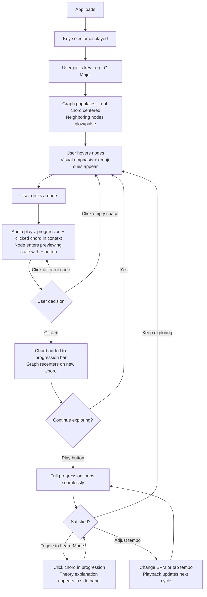
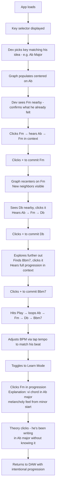
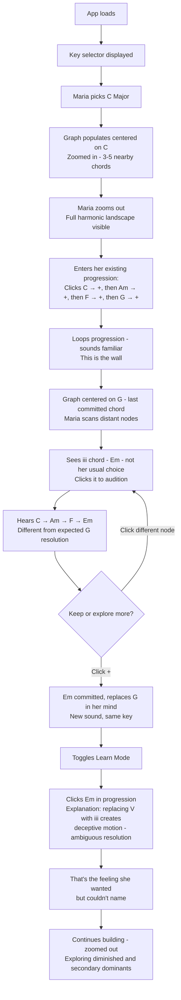

# UX Design Specification - Songwriter

**Author:** Omar
**Date:** 2026-04-13

---

<!-- UX design content will be appended sequentially through collaborative workflow steps -->

## Executive Summary

### Project Vision

Songwriter is a desktop-first SPA that transforms static chord reference tools into an interactive creative instrument. Users navigate an interactive chord network graph where spatial distance represents harmonic closeness, hear chords in context through seamless loop playback, and receive AI-powered music theory guidance. The MVP delivers 4 core features: chord network graph (major, minor, 7th, augmented, diminished), zoom levels, contextual audio playback, and Flow/Learn mode toggle. All state is client-side with no user accounts for MVP.

### Target Users

- **Jake (beginner, 19):** Self-taught guitarist, bored of 4 chords. Needs zero-friction onboarding, zoomed-in default, Flow Mode as default. Success = discovering a surprising chord in first session.
- **Dev (producer, 27):** Builds beats by ear, wants to understand theory through creation. Needs fast chord validation, loop-friendly playback, and theory connected to genre context.
- **Maria (experienced, 34):** Working songwriter hitting creative walls. Needs zoom-out for full harmonic landscape, Learn Mode with proper terminology. Full journey (section builder) comes in Phase 2.

### Key Design Challenges

1. **The graph is the product** — the spatial metaphor (close = safe, far = adventurous) must be immediately intuitive with no standard UI convention to lean on. If users don't grasp it within seconds, the product fails.
2. **Three-channel coordination** — graph position, audio playback, and AI explanations must work together without overwhelming when a user taps a chord.
3. **Dual-mode interface** — Flow Mode (creative momentum) and Learn Mode (analytical learning) serve different cognitive states but must feel native to the same interface.

### Design Opportunities

1. **The graph teaches without teaching** — spatial metaphor makes harmonic relationships intuitive through navigation, not study.
2. **Zoom as skill proxy** — beginners see 3-5 options zoomed in, advanced users see the full landscape. Same interface, different depths.
3. **Audio preview as delight** — hearing the chord in context before committing is the core differentiator from every static chord tool.

## Core User Experience

### Defining Experience

The core interaction loop is: **tap a chord → hear it in context → see guidance → decide to keep or explore further**. Every UX decision serves this loop. The graph is not a settings panel or a secondary view — it is the primary interface. Users spend 90%+ of their time interacting with the graph and listening to results.

### Platform Strategy

- **Desktop-first SPA** — mouse and keyboard primary input, 1280px+ target viewport, 1024px minimum
- **Mouse interaction model:** hover for visual preview (emoji cues, no audio), click to audition (audio in context), "+" to commit
- **Keyboard navigation:** arrow keys for graph traversal, spacebar for play/stop, tab for mode toggle
- **No account, no setup** — the app loads with a default key and starting chord, ready to explore immediately
- **Always-connected** — AI explanations require network; no offline mode for MVP

### Effortless Interactions

**Starting must be instant:**
- App loads → graph is visible → a starting chord is selected → user can click any neighboring node immediately
- No onboarding wizard, no tutorial modal, no account creation gate
- The graph itself communicates "click something" through visual affordance (glowing/pulsing nearby nodes)

**Previewing must be zero-commitment:**
- Hovering a chord node shows visual feedback and emoji cues — no audio on hover, scanning is silent and low-pressure
- Clicking a chord node plays the transition in context — user hears before they commit
- Committing (clicking "+") is a separate, deliberate action from previewing (clicking)

### Critical Success Moments

1. **First 30 seconds** — User must understand "I click these nodes and hear chords" without any instruction. If they don't click something within 30 seconds, the product has failed.
2. **First surprise** — Within 2-3 clicks, the user hears a chord they wouldn't have chosen. The graph showed them something their ear couldn't find on its own. This is the moment they understand the product's value.
3. **First explanation** — User toggles to Learn Mode (or sees a Flow Mode emoji cue) and gets context for *why* the chord works. Theory becomes tangible, not abstract.
4. **First loop** — User plays back their progression on loop and hears something that sounds like *their* music. This is the emotional payoff that drives return usage.

### Experience Principles

1. **The graph is the teacher** — If users need to read instructions to use the app, the graph design has failed. Spatial layout, visual weight, and node proximity should communicate harmonic relationships without words.
2. **Hear before you commit** — Every chord decision should be auditioned in context before it's added to the progression. Exploration is free; commitment is deliberate.
3. **Never interrupt creative flow** — Flow Mode is the default. Theory explanations are available but never pushed. The app respects the difference between "I'm writing" and "I'm learning."
4. **Progressive depth, not progressive complexity** — Zooming out reveals more options but doesn't change how the interface works. Learn Mode adds information but doesn't add steps. Depth is always opt-in.

## Desired Emotional Response

### Primary Emotional Goals

- **Wonder and discovery** — "I had no idea this chord existed and it sounds amazing." The product should feel like exploring uncharted territory where every click might reveal something beautiful and unexpected.
- **Shareability through amazement** — "You won't believe what this app showed me." The emotion that drives word-of-mouth is not pride in craft but excitement about discovery — the app is the magic, and users want to show others the magic.
- **Low-stakes exploration** — "Try another one, no big deal." Wrong choices are costless. The app never punishes experimentation, never makes users feel they've broken something, never requires undoing. Every path leads somewhere interesting.

### Emotional Journey Mapping

| Stage | Desired Emotion | Design Implication |
|---|---|---|
| First visit | Curiosity — "what happens if I click this?" | Pulsing/glowing nodes invite interaction without instruction |
| First chord tap | Surprise — "whoa, that sounds cool" | Contextual audio preview delivers instant emotional reward |
| First progression | Wonder — "I made this?" | Loop playback makes their creation feel like real music |
| First explanation | Illumination — "so THAT'S why it works" | Learn Mode connects ear to brain without breaking flow |
| Returning visit | Anticipation — "what will I discover this time?" | Graph state resets to encourage fresh exploration |
| Something sounds wrong | Shrug — "no big deal, try another" | No error states, no warnings, just move to the next node |

### Micro-Emotions

**Prioritize:**
- **Confidence over confusion** — the graph must feel navigable, not overwhelming. Zoom-in default ensures beginners see manageable choices.
- **Excitement over anxiety** — exploring distant chords should feel adventurous, not risky. Audio preview removes the fear of committing to something bad.
- **Delight over mere satisfaction** — the "surprise chord" moment should feel like a gift, not a task completion.

**Avoid:**
- **Frustration** — if audio doesn't play instantly or AI explanations lag, wonder collapses into impatience
- **Inadequacy** — Learn Mode must never make users feel they should have known this already
- **Overwhelm** — zoomed-out view must feel like possibility, not complexity

### Design Implications

- **Wonder requires instant feedback** — hover preview must be immediate (<200ms). Delay kills the magic of discovery.
- **Low stakes requires easy undo** — removing a chord from the progression must be trivial. No confirmation dialogs, no "are you sure?"
- **Shareability requires visible output** — the progression display must look good enough that users want to screenshot it
- **Forgiveness requires no dead ends** — every chord on the graph connects to other chords. There's no way to "get stuck"
- **Illumination requires brevity** — Learn Mode explanations should be 1-2 sentences, not paragraphs. Wonder fades if you have to read an essay.

### Emotional Design Principles

1. **Discovery, not instruction** — the app reveals possibilities; it never lectures. Users feel like explorers, not students.
2. **Every click is a gift** — each chord tap should deliver something worth hearing. The graph's spatial weighting ensures even "random" clicks produce musically interesting results.
3. **Failure doesn't exist** — there are no wrong chords, only unexpected ones. The app's tone (emoji cues, explanation language) should frame every choice as a valid creative decision.
4. **Brevity preserves wonder** — the moment you over-explain, the magic dissipates. Keep Flow Mode cues to single icons and Learn Mode explanations to 1-2 sentences.

## UX Pattern Analysis & Inspiration

### Inspiring Products Analysis

**Logic Pro — Professional power with visual clarity**
- Direct manipulation model: every click/drag produces immediate audio feedback with no abstraction layer between action and output
- Multi-track visual timeline makes complex structures scannable at a glance
- Professional-quality output from first session — never feels like a toy

**Tape It — Creative capture with zero friction**
- One-tap core action (record) is always accessible regardless of app state
- Minimal interface that gets out of the way during creative moments
- Beautiful design that makes the output feel valuable and shareable

**Canva — Professional output for non-professionals**
- Smart defaults and templates eliminate blank-canvas paralysis
- Drag-and-drop feels immediate — no delay between intention and result
- Progressive disclosure: simple surface, depth available when sought
- Non-designers produce professional-looking output without training

### Transferable UX Patterns

**From Logic Pro → Songwriter:**
- Direct manipulation with instant audio feedback — tap chord, hear chord, no intermediate steps
- Visual spatial layout that makes relationships scannable without reading

**From Tape It → Songwriter:**
- One-interaction core action — the graph click is our "record button"
- Minimal chrome — the graph dominates the viewport, controls are peripheral
- Interface disappears during creative flow

**From Canva → Songwriter:**
- Smart defaults eliminate blank-canvas paralysis — app loads with a key selected and a starting chord highlighted
- Users produce something good-sounding before they understand the theory
- Progressive disclosure through zoom levels — simple surface, depth when you want it

### Anti-Patterns to Avoid

- **Tutorial-gated onboarding** (many music apps) — forcing users through a walkthrough before they can play. Songwriter must be immediately interactive.
- **Settings-heavy interfaces** (many DAWs) — configuration screens before creation. No settings for MVP — smart defaults only.
- **Text-heavy theory presentation** (music education apps) — walls of explanation that break creative flow. Explanations must be 1-2 sentences max.
- **Isolated sound previews** (chord dictionary apps) — hearing a chord in isolation teaches nothing. Contextual playback is non-negotiable.
- **Modal dialogs for reversible actions** — "Are you sure you want to remove this chord?" kills exploration momentum. Just remove it; undo is enough.

### Design Inspiration Strategy

**Adopt:**
- Logic Pro's instant audio feedback model — every graph interaction produces sound
- Tape It's minimal interface philosophy — graph is 80%+ of the viewport
- Canva's smart defaults approach — no blank canvas, no setup required

**Adapt:**
- Canva's progressive disclosure → zoom levels as progressive disclosure (not menus or panels)
- Logic Pro's visual timeline → progression display as a horizontal sequence below the graph
- Tape It's one-tap recording → one-click chord commitment after hover preview

**Avoid:**
- Tutorial modals, setup wizards, account gates
- Settings panels or configuration screens
- Isolated audio playback without progression context
- Text-heavy explanations that break creative flow

## Design System Foundation

### Design System Choice

**Tailwind CSS + Headless UI Components** (Radix UI or Headless UI)

Utility-first CSS framework paired with unstyled, accessible component primitives. The chord network graph (Canvas/WebGL) lives outside the design system entirely — this foundation covers only the surrounding UI chrome: controls, progression display, mode toggle, explanation panel, and playback controls.

### Rationale for Selection

- **Solo dev speed** — utility classes eliminate context-switching between files. No custom CSS to write or maintain for standard UI elements.
- **Graph independence** — the core product (chord network visualization) is Canvas/WebGL-rendered and won't use any design system components. The design system only needs to handle peripheral UI.
- **Visual flexibility** — no opinionated visual style imposed. Songwriter gets its own identity rather than looking like a Material or Bootstrap app.
- **Accessibility by default** — headless components provide correct keyboard navigation, focus management, and ARIA attributes out of the box, directly supporting WCAG 2.1 AA requirements.
- **Minimal surface area** — MVP has very few standard UI components (toggle, buttons, a panel, a sequence display). A heavyweight design system would be overkill.

### Implementation Approach

- **Tailwind CSS** for all layout, spacing, typography, and color
- **Headless components** (Radix UI) for interactive elements: mode toggle, dropdown menus, tooltip/popover for explanations, keyboard-accessible buttons
- **Custom components** for: chord network graph (Canvas/WebGL), progression sequence display, audio playback controls
- **Design tokens** defined in Tailwind config: color palette, spacing scale, typography scale, animation timing

### Customization Strategy

- Define a cohesive color palette in Tailwind config that supports both the standard UI and graph visualization (node colors, edge colors, emphasis states)
- Typography: one display font for chord names/labels on the graph, one UI font for controls and explanations
- Animation timing tokens: consistent hover/transition durations across graph interactions and UI elements
- Dark-first or light-first decision deferred to visual design phase — Tailwind supports both with minimal effort

## Defining Experience

### The Core Interaction

**"Click a chord on the map, hear it in your progression, discover why it works."**

This is the interaction users describe to friends. It combines a novel pattern (spatial chord network) with familiar mechanics (click to hear). Users don't learn a new paradigm — they click things and listen — they just need to grasp what the spatial layout means.

### User Mental Model

**What users bring:** Familiarity with clicking interactive elements and hearing audio feedback. No music theory knowledge assumed. The mental model is closer to "exploring a map" than "reading a chart."

**Current solutions and their gaps:**
- Static chord wheels/charts → users look at them, but can't *hear* the relationships
- Chord dictionary apps → isolated playback, no progression context
- DAW chord plugins → powerful but require existing DAW knowledge and setup
- YouTube tutorials → passive consumption, not interactive exploration

**Key mental model shift:** Users currently think of chords as a *list to memorize*. Songwriter reframes chords as *places on a map to explore*. The graph makes this shift visual and immediate.

### Success Criteria

- User picks a starting key/chord and begins exploring within 10 seconds of app load
- Click-to-preview delivers instant audio feedback — user hears before they decide
- The "surprise chord" moment occurs within 2-3 graph interactions
- Progression bar is interactive — clicking a chord replays it, no dead display elements
- Removing a chord is discoverable (hover-X) but never in the way of replaying
- Flow Mode cues (emoji/icons) appear on hover — user absorbs them while scanning
- Learn Mode explanation appears within 2 seconds and is readable in under 5 seconds

### Novel UX Patterns

**Novel — the spatial chord graph:**
- No established UX convention for "harmonic distance as spatial proximity"
- Users learn the metaphor by exploring, not by reading — close nodes sound familiar, distant nodes sound surprising
- The graph teaches its own metaphor through audio feedback: click a close node (sounds natural), click a far node (sounds unexpected). The pattern self-explains.

**Familiar — everything else:**
- Click to preview, explicit action to commit (standard try-before-you-buy pattern)
- Toggle between modes (standard toggle switch)
- Horizontal progression bar (familiar from DAW timelines and music apps)
- Play/stop/loop controls (universal audio controls)

**The design challenge:** make the novel part (graph) feel as natural as the familiar parts (controls, playback). The graph must not feel like a "special widget" — it must feel like the obvious way to pick chords.

### Experience Mechanics

**1. Initiation:**
- App loads → simple key/chord selector is presented (e.g., "Pick a key to start")
- User selects starting key and root chord → graph populates with that chord centered
- Default tempo: 120 BPM — no tempo selection required during setup
- Neighboring nodes glow/pulse to invite first click
- No tutorial, no modal — the visual affordance is the onboarding

**2. Exploration (hover = visual only):**
- User hovers over a neighboring chord node
- Node visually emphasizes (size, brightness, or border change)
- Flow Mode cue appears on the node (emoji: thumbs up, fire, sparkle, etc.)
- No audio on hover — scanning the graph is silent and low-pressure

**3. Preview (click = audition):**
- User clicks a chord node → audio plays the current progression + clicked chord in context
- Node enters "previewing" state (visually distinct — pulsing glow or highlighted border)
- A small "+" button appears on or near the node to add to progression
- Clicking a different node replaces the preview — previous preview dismissed, new chord plays
- Clicking empty space dismisses the preview and returns to exploration
- Users can click through multiple nodes quickly to audition without committing any

**4. Commitment (+ = add to progression):**
- User clicks "+" on a previewing node → chord commits to progression
- Progression bar updates with the new chord
- Graph recenters on the newly committed chord — new neighbors appear
- The cycle repeats: hover to scan, click to audition, "+" to keep

**5. Progression interaction:**
- Clicking a chord in the progression bar replays it in context (not removes it)
- Hovering a chord in the progression bar reveals a small X to remove
- Play button loops the full progression seamlessly
- Clear button resets the progression (no confirmation dialog)

**6. Tempo control:**
- BPM control visible near playback controls (small, adjustable number input)
- Tap tempo button alongside BPM control — tap a rhythm to set tempo by feel
- BPM changes apply immediately to the next loop cycle — no restart required

**7. Mode switching:**
- Toggle between Flow Mode and Learn Mode via persistent toggle
- Flow Mode (default): emoji cues visible on hover, no text explanations
- Learn Mode: clicking a committed chord shows 1-2 sentence theory explanation in a side panel or tooltip
- Switching modes never interrupts playback or resets the graph

## Visual Design Foundation

### Color System

**Light and airy base — warmth meets clarity**

- **Background:** Warm white/off-white (#FAFAF8 or similar) — not sterile, not clinical
- **Surface:** Slightly warm light gray for panels and cards — subtle separation without harsh borders
- **Text:** Dark warm gray (#2D2D2D) — softer than pure black, easier on eyes for theory explanations

**Graph-specific colors:**
- **Current chord node:** Warm accent color (e.g., coral/amber) — clearly "you are here"
- **Strong next moves (close nodes):** Saturated, inviting — draws the eye
- **Distant/adventurous nodes:** Desaturated or cooler tones — visually "further away" reinforces the spatial metaphor
- **Previewing state:** Pulsing glow or bright ring around the auditioned node
- **Committed chords in progression:** Consistent accent color matching the progression bar

**Semantic colors:**
- **Flow Mode cues:** Emoji-based, but background tints can reinforce (warm = safe, cool = adventurous, bright = bold)
- **Interactive elements:** Single primary accent color for all clickable actions (+, play, toggle)
- **No error red needed** — there are no errors in Songwriter, only exploration

**Accessibility:** All text meets WCAG 2.1 AA contrast ratios (4.5:1 minimum). Graph node differentiation uses shape and size alongside color — never color alone.

### Typography System

**Primary font: Nunito** — rounded, warm, friendly. Reinforces the approachable, non-academic tone. Music theory should feel inviting, not intimidating.

| Element | Style | Size | Weight |
|---|---|---|---|
| Chord names (on graph nodes) | Nunito | 16-20px (scales with zoom) | Bold (700) |
| Progression bar chords | Nunito | 16px | Semi-bold (600) |
| Flow Mode emoji cues | System emoji | 20px | — |
| Learn Mode explanations | Nunito | 14-15px | Regular (400) |
| UI controls/labels | Nunito | 13-14px | Medium (500) |
| Key/BPM display | Nunito | 14px | Semi-bold (600) |

**Type scale:** Based on 4px increments — 12, 14, 16, 20, 24, 32px. Minimal hierarchy needed since the app is interaction-heavy, not text-heavy.

**Line height:** 1.5 for body text (Learn Mode explanations), 1.2 for labels and controls.

### Spacing & Layout Foundation

**Spacious and breathing — the graph needs room**

- **Base spacing unit:** 8px
- **Spacing scale:** 4, 8, 12, 16, 24, 32, 48, 64px
- **Component spacing:** 16-24px between distinct UI areas
- **Inner padding:** 12-16px within cards/panels

**Layout structure (desktop 1280px+):**
- **Graph area:** 70-80% of viewport — the graph is the product, it dominates
- **Progression bar:** Full width, fixed at bottom — horizontal chord sequence with playback controls and BPM/tap tempo
- **Explanation panel:** Right side or floating panel, 20-30% width — only visible in Learn Mode
- **Mode toggle:** Persistent, top-right corner — always accessible but never in the way
- **Key/chord selector:** Top area or top-left — used once at start, then recedes

**Grid:** No rigid column grid — the graph is freeform Canvas/WebGL. Standard layout grid (12-column) only applies to the non-graph UI chrome (progression bar, explanation panel, controls).

**White space philosophy:** Generous padding around the graph area. The graph should feel like an open landscape, not a cramped widget. Peripheral UI elements have clear visual separation but don't compete for attention.

### Accessibility Considerations

- All text on light backgrounds meets 4.5:1 contrast ratio minimum
- Graph nodes use shape (circle, rounded square, diamond) and size alongside color to differentiate chord types
- Focus indicators are visible and high-contrast for keyboard navigation
- Explanation text is a readable size (14-15px minimum) with sufficient line height (1.5)
- Interactive targets (nodes, buttons, +) meet minimum 44x44px touch/click target size
- Mode toggle has clear visual state distinction beyond color alone (icon change, position change)

## Design Direction Decision

### Design Directions Explored

Six directions were generated exploring layout (centered, side panel, full bleed), accent color (warm coral, cool blue, monochrome), and visual weight variations. All shared the same foundation: light/airy background, Nunito typography, spacious layout, graph-dominant viewport.

### Chosen Direction

**Direction 5: Cool Blue Accent** — centered graph layout with cool blue (#5B8DEF) as the primary accent color.

- **Layout:** Centered graph with side panel available for Learn Mode
- **Accent:** Cool blue (#5B8DEF) — calm, focused, trustworthy
- **Background:** Warm off-white (#FAFAF8)
- **Node colors:** Blue-tinted palette — close nodes in saturated blue tones, distant nodes in desaturated/muted tones
- **Progression bar:** Bottom-fixed, blue accent for committed chords
- **Interactive elements:** Blue for all primary actions (+, play, toggle active state)

### Design Rationale

- **Cool blue supports exploration** — calm, non-urgent tone encourages clicking without pressure. Warm colors create energy that could feel pushy.
- **Blue = trust** — users need to trust the AI explanations. Blue reinforces credibility and clarity.
- **Emoji cues pop against blue** — the warm emoji colors (fire, sparkle, thumbs up) contrast naturally against the cool accent, creating visual hierarchy without effort.
- **Professional but approachable** — blue avoids feeling toy-like or sterile. It says "this is a real tool" while staying inviting.
- **Accessible** — blue provides strong contrast on light backgrounds and is distinguishable by most color-blind users when paired with shape/size differentiation.

### Implementation Approach

**Tailwind color tokens:**
- `primary-50` through `primary-900`: Blue scale based on #5B8DEF
- `surface`: #FAFAF8 (warm off-white)
- `surface-elevated`: #FFFFFF (cards, panels, progression bar)
- `text-primary`: #2D2D2D
- `text-secondary`: #777777
- `border`: #D0CDC8 (warm gray borders)

**Graph-specific palette:**
- Current chord: #5B8DEF (solid blue, white text)
- Close nodes: #EBF1FF background, #4070CC text, #A0C0F0 border
- Medium nodes: #E8F0FF background, #3860BB text, #90B0E8 border
- Distant nodes: #F0F0ED background, #888 text, #D0CDC8 border
- Previewing state: Pulsing blue glow (box-shadow animation on #5B8DEF)

## User Journey Flows

### Journey 1: First-Time Exploration (Jake)

**Goal:** Discover a surprising chord and build a first progression within one session.

**Key UX moments:**
- **0-10 seconds:** Key selected, graph visible, glowing nodes invite first click
- **10-30 seconds:** First click → audio plays → surprise moment ("whoa, that sounds cool")
- **30-60 seconds:** 2-3 chords committed, progression looping
- **1-2 minutes:** Toggle Learn Mode, read first explanation, theory clicks

**Error recovery:** None needed. No wrong choices exist. Clicking empty space dismisses preview. Clear button resets everything.

### Journey 2: Build From Existing Idea (Dev)

**Goal:** Start with a known chord, find what fits, build a loop, understand the theory.

**Key UX moments:**
- **Confirmation:** Seeing his known chord (Fm) close to Ab on the graph validates his ear
- **Discovery:** Finding Bbm7 further out — a chord he wouldn't have tried by ear
- **Theory click:** Learn Mode explanation connects what he hears to formal theory
- **Tempo match:** Tap tempo lets him match his DAW's feel without knowing the exact BPM

### Journey 3: Deep Exploration (Maria)

**Goal:** Break through creative wall by discovering chord options beyond her habits.

**Key UX moments:**
- **Zoom out:** Maria needs to see beyond the 3-5 obvious choices — the full landscape reveals options she'd stopped seeing
- **Replacing a habit:** Auditioning Em where she'd normally use G — the graph showed her the alternative
- **Naming the feeling:** Learn Mode explanation gives her vocabulary for what her ear recognized but couldn't articulate

### Journey Patterns

**Shared across all journeys:**

| Pattern | Description | Implementation |
|---|---|---|
| **Pick & explore** | Every journey starts with key selection then graph exploration | Key selector → graph populate → hover/click cycle |
| **Audition before commit** | Click to hear, + to keep — universal across all personas | Preview state with + button on every node interaction |
| **Loop to validate** | Users loop their progression to hear it as music, not isolated chords | Play button always available once 2+ chords committed |
| **Theory on demand** | Learn Mode is always one toggle away, never forced | Persistent toggle, side panel slides in/out |
| **Tempo by feel** | BPM control + tap tempo near playback controls | Number input + tap button, changes apply next cycle |

**Entry point divergence:**
- Jake: Starts from zero knowledge — needs glowing nodes to invite first click
- Dev: Starts with a known chord in mind — needs to quickly find and confirm it on the graph
- Maria: Starts with an existing progression — needs to enter multiple chords then explore alternatives

### Flow Optimization Principles

1. **Every journey reaches audio within 2 clicks** — pick key (click 1), click a node (click 2), hear sound. No journey requires more than 2 interactions before audio feedback.
2. **Commit is always optional** — users can click through 10 nodes auditioning without committing any. Exploration is free.
3. **The graph recenters after each commit** — keeps the next set of options visible without manual navigation. Users don't get lost.
4. **Playback never stops for UI actions** — toggling modes, hovering nodes, or adjusting BPM doesn't interrupt a running loop. Creative flow is protected.
5. **No dead ends** — every committed chord has neighbors. Every progression can be extended. Clear button is the only "reset" and it's intentional.

## Component Strategy

### Design System Components

**From Radix UI (headless, styled with Tailwind):**

| Component | Usage | Customization |
|---|---|---|
| Toggle | Flow/Learn mode switch | Blue active state, icon change (🎵/📖) |
| Popover | Learn Mode explanation display | Positioned relative to clicked chord in progression bar |
| Select | Key selector dropdown | Styled to match warm off-white surface |
| Tooltip | Hover hints on controls | Minimal, brief labels only |
| VisuallyHidden | Screen reader content | Chord relationships, graph state announcements |

### Custom Components

#### 1. Chord Network Graph (Canvas/WebGL)

**Purpose:** Primary interface — renders the interactive chord map where spatial distance represents harmonic closeness.

**Anatomy:**
- Canvas/WebGL rendering surface (fills 70-80% of viewport)
- Chord nodes positioned by harmonic relationship algorithm
- Visual connections between related nodes (optional subtle lines)
- Zoom controls overlay (top of graph area)

**States:**
- **Default:** All nodes visible at current zoom level, positioned by harmonic distance
- **Zoomed in:** 3-5 closest nodes visible, larger node sizes
- **Zoomed out:** Full harmonic landscape, smaller nodes, more visible
- **Animating:** Smooth transition during zoom or recenter

**Interactions:**
- Mouse wheel / pinch to zoom
- Click + drag to pan (zoomed out)
- Recenters automatically on committed chord

**Accessibility:**
- Arrow keys to navigate between nodes (focus ring visible)
- Screen reader announces: node name, chord type, distance from current (close/medium/far)
- Zoom controllable via +/- buttons (not just scroll)

#### 2. Chord Node

**Purpose:** Individual interactive chord within the graph.

**Anatomy:**
- Circular node with chord name (e.g., "Am", "Bbmaj7")
- Shape varies by chord type: circle (major), rounded square (minor), diamond (7th), hexagon (augmented), triangle (diminished)
- Size varies by harmonic proximity (closer = larger)
- Emoji cue position (top-right, visible on hover in Flow Mode)
- "+" button position (bottom-right, visible in previewing state)

**States:**

| State | Visual | Trigger |
|---|---|---|
| Default | Blue-tinted fill, sized by distance | Idle |
| Hover | Scale up 15%, brighter fill, emoji cue appears | Mouse enter |
| Previewing | Pulsing blue glow, + button visible | Click |
| Committed | Solid blue (#5B8DEF), white text | In progression |
| Focused | High-contrast focus ring | Keyboard navigation |

**Accessibility:**
- Role: button
- aria-label: "[Chord name] — [distance: close/medium/far move]"
- Keyboard: Enter to preview, then Enter again or Tab to + button to commit

#### 3. Progression Bar

**Purpose:** Displays the current chord progression as a horizontal sequence. Doubles as a playback instrument (click to replay) and editor (hover-X to remove).

**Anatomy:**
- Horizontal strip fixed at bottom of viewport
- Ordered chord chips (left to right = progression order)
- Playback controls group (right side)
- BPM/tap tempo group (right side, after playback)
- Clear button (far right, de-emphasized)

**Chord Chip States:**

| State | Visual | Trigger |
|---|---|---|
| Default | Blue accent background (#EBF1FF), blue text | Idle |
| Hover | Slight lift (translateY -2px), X remove button appears | Mouse enter |
| Playing | Brief highlight/pulse when reached during playback | Loop playback |
| Focused | Focus ring | Keyboard navigation |

**Interactions:**
- Click chord chip → replays that chord in progression context
- Hover chord chip → small X appears top-right
- Click X → removes chord from progression (no confirmation)
- Reorder deferred from MVP

**Accessibility:**
- Role: list of buttons
- aria-label per chip: "[Chord name], position [n] of [total]. Click to replay, hover for remove."
- Keyboard: Tab between chips, Enter to replay, Delete to remove

#### 4. Playback Controls

**Purpose:** Play, stop, and loop the current progression with tempo control.

**Anatomy:**
- Play/Loop button (primary action, blue)
- Stop button (secondary)
- BPM number input (small, editable)
- "BPM" label
- Tap tempo button

**States:**

| State | Visual | Trigger |
|---|---|---|
| Stopped | Play icon, blue primary button | Default |
| Playing/Looping | Pause icon replaces play, button stays blue | Playing |
| Disabled | Grayed out, no interaction | < 2 chords in progression |

**Interactions:**
- Click Play → loops progression seamlessly
- Click Stop → stops playback
- Edit BPM input → changes tempo, applies next loop cycle
- Click Tap → records tap intervals, averages to BPM after 4+ taps

**Accessibility:**
- Play/Stop: aria-label updates with state ("Play progression" / "Stop playback")
- BPM input: aria-label "Tempo in beats per minute"
- Tap tempo: aria-label "Tap to set tempo"
- Spacebar shortcut for play/stop

#### 5. Explanation Panel

**Purpose:** Displays AI-generated music theory explanations in Learn Mode.

**Anatomy:**
- Slides in from right side (280px width)
- Chord name (large, bold)
- "Why this works" heading
- 1-2 sentence explanation text
- Chord function card (e.g., "vi — Relative Minor")
- Chord character card (e.g., "Melancholy, introspective")

**States:**

| State | Visual | Trigger |
|---|---|---|
| Hidden | Not rendered, graph takes full width | Flow Mode active |
| Visible | Slides in from right, graph area shrinks | Learn Mode active |
| Loading | Skeleton/shimmer on explanation text | Waiting for AI response |
| Populated | Full explanation content displayed | AI response received |

**Interactions:**
- Appears when Learn Mode toggled on
- Content updates when user clicks a chord in the progression bar
- Dismiss by toggling back to Flow Mode

**Accessibility:**
- Role: complementary (aside)
- aria-live: polite (announces new explanations to screen readers)
- All text content readable by screen reader
- Focusable for keyboard users

#### 6. Key Selector

**Purpose:** Initial selection of musical key before graph populates. Used once at start, then recedes.

**Anatomy:**
- Dropdown or segmented control for key root (C, C#, D, etc.)
- Dropdown or toggle for quality (Major / Minor)
- "Start exploring" implicit — graph populates on selection

**States:**

| State | Visual | Trigger |
|---|---|---|
| Initial | Centered on screen, prominent | App first load, no key selected |
| Selected | Moves to top-left corner, compact display | Key chosen |
| Compact | Shows current key as label, clickable to change | During exploration |

**Interactions:**
- Select key root + quality → graph populates immediately
- Can change key later via compact selector in top bar (clears progression)

**Accessibility:**
- Standard select/dropdown accessibility via Radix Select
- aria-label: "Select musical key"

### Component Implementation Strategy

**Build order (by journey criticality):**

| Priority | Component | Rationale |
|---|---|---|
| 1 | Key Selector | Gate to everything — nothing works without it |
| 2 | Chord Network Graph + Chord Nodes | The product IS the graph |
| 3 | Playback Controls + Audio Engine | Hearing chords is the core value |
| 4 | Progression Bar | Tracks what the user has built |
| 5 | Flow/Learn Toggle | Enables dual-mode experience |
| 6 | Explanation Panel | Learn Mode content delivery |

**Implementation principles:**
- Build graph and audio first — these are the highest-risk, highest-value components
- Use Radix primitives for all standard interactive elements (toggle, select, popover)
- Style everything with Tailwind utility classes — no custom CSS files
- Each component is self-contained with its own state management
- Accessibility is built in from the start, not retrofitted

### Implementation Roadmap

**Phase 1 — Core Loop (MVP critical path):**
- Key Selector → Chord Network Graph → Chord Nodes → Audio Engine → Playback Controls → Progression Bar

**Phase 2 — Dual Mode:**
- Flow/Learn Toggle → Explanation Panel → AI integration for theory content

**Phase 3 — Polish:**
- Zoom animation smoothing, node transition animations, tap tempo refinement, keyboard shortcuts

## UX Consistency Patterns

### Interaction Feedback

Every user action produces immediate, visible feedback. No action goes unacknowledged.

| Action | Feedback | Timing |
|---|---|---|
| Hover graph node | Node scales up 15%, brightness increases, emoji cue fades in | Instant (<50ms) |
| Click graph node (preview) | Audio plays in context, node enters pulsing glow state, + button appears | Audio <200ms, visual instant |
| Click + (commit) | Chord chip animates into progression bar, graph smoothly recenters | 300ms transition |
| Hover progression chip | Chip lifts slightly (translateY -2px), X button fades in | Instant |
| Click progression chip | Audio replays that chord in context, chip briefly pulses | Audio <200ms |
| Click X on chip | Chip shrinks and fades out, remaining chips slide to close gap | 200ms animation |
| Toggle Flow/Learn | Toggle slides, panel slides in/out from right | 250ms ease-out |
| Click Play | Button icon swaps to pause, progression chips begin sequential highlighting | Instant visual, audio <200ms |
| Click Stop | Button icon swaps to play, chip highlighting stops | Instant |
| Adjust BPM | Number updates immediately, tempo change applies on next loop cycle | Visual instant, audio next cycle |
| Tap tempo | Each tap briefly highlights the tap button, BPM updates after 4+ taps | Per-tap feedback, BPM after 4th |
| Zoom in/out | Graph smoothly scales, nodes resize, labels resize | 300ms transition |
| Click empty space | Preview state dismissed, node returns to default | 150ms fade |
| Clear progression | All chips shrink and fade simultaneously, graph returns to key root | 300ms animation |

### State Transitions

**Animation principles:**
- **Duration:** 150-300ms for all UI transitions. Never longer — speed preserves creative flow.
- **Easing:** ease-out for entries (feels snappy), ease-in-out for repositioning (feels smooth)
- **Audio transitions:** Crossfade between chord sounds during preview switching — no abrupt cuts
- **Graph recentering:** Smooth pan animation (300ms) when committing a chord, not instant jump

**Transition hierarchy:**
- **Instant** (<50ms): Hover effects, cursor changes, emoji cue appearance
- **Fast** (150ms): State changes within a component (button icon swap, chip lift, X appear)
- **Standard** (250-300ms): Layout changes (panel slide, graph recenter, chip add/remove)
- **Never used:** Transitions >500ms — they feel sluggish for a creative tool

### Loading & Empty States

**Initial state (no key selected):**
- Graph area shows the key selector centered and prominent
- Warm off-white background with subtle radial gradient suggesting "something will appear here"
- No loading spinner, no skeleton — just the key selector inviting interaction

**Graph populating (after key selection):**
- Nodes appear with a staggered fade-in from center outward (200ms total)
- Root chord appears first and largest, neighbors follow by proximity
- Feels like the graph "blooms" from the root chord

**AI explanation loading:**
- Explanation panel shows skeleton shimmer on text areas (chord name stays, text shimmers)
- Duration: typically <2 seconds
- If >2 seconds: shimmer continues, no spinner or error message
- If >5 seconds: subtle "Still thinking..." text below shimmer

**Empty progression bar:**
- Shows placeholder text: "Click a chord to start building" in muted gray (#999)
- Playback controls are disabled (grayed out) until 2+ chords committed
- No empty state illustration or icon — keep it minimal

**Progression cleared:**
- Chips animate out (shrink + fade, 300ms)
- Placeholder text fades back in
- Graph recenters on key root chord
- Playback stops immediately if playing

### Audio Feedback Patterns

**When audio plays:**
- Clicking a graph node (preview) — plays progression + previewed chord in context
- Clicking a progression chip — replays that chord in progression context
- Clicking Play — loops full progression continuously

**When audio does NOT play:**
- Hovering any element — silent, visual-only feedback
- Toggling Flow/Learn mode — no audio change
- Zooming — no audio
- Removing a chord — no audio (if playing, loop updates on next cycle)
- Adjusting BPM — no immediate audio; tempo applies next loop cycle

**Audio behavior rules:**
- Only one audio stream at a time — new preview interrupts previous preview
- Loop playback is seamless — no gap between end and restart
- Preview audio plays the full progression context (last 2-3 chords + previewed chord), not just the single chord in isolation
- Audio stops when: Stop button clicked, or app loses focus (optional)
- BPM changes mid-loop: finish current cycle at old BPM, start next cycle at new BPM

**First audio interaction:**
- Web Audio API requires user gesture to initialize. The first click on a graph node serves as this gesture.
- No "click to enable audio" banner — the key selection click may initialize audio context preemptively.

### Keyboard Shortcuts

| Shortcut | Action |
|---|---|
| Space | Play/Stop toggle |
| M | Toggle Flow/Learn mode |
| + / = | Zoom in |
| - | Zoom out |
| Backspace | Remove last chord from progression |
| Escape | Dismiss preview / deselect |
| Arrow keys | Navigate between graph nodes |
| Enter | Preview selected node / commit if previewing |
| Tab | Cycle between UI areas (graph, progression, controls) |

## Responsive Design & Accessibility

### Responsive Strategy

**Desktop-first, desktop-only for MVP.**

| Viewport | Strategy |
|---|---|
| 1280px+ | Primary design target. Full graph, progression bar, explanation panel side-by-side. |
| 1024-1279px | Supported. Graph area slightly reduced, explanation panel overlaps as popover instead of side panel. |
| 768-1023px (tablet) | Graceful degradation. Functional but not optimized. Graph may require scroll/pan. |
| <768px (mobile) | Not supported for MVP. Show message: "Songwriter is designed for desktop. Please visit on a larger screen." |

**Desktop layout behavior:**
- Graph area scales fluidly with viewport width (70-80% of available space)
- Progression bar is always full-width, fixed at bottom
- Explanation panel slides in from right, reducing graph area proportionally
- Top bar (key selector, zoom, mode toggle) collapses gracefully at narrower widths

**No mobile investment for MVP.** The chord network graph requires mouse precision (hover, click, +) and screen real estate that mobile can't provide without a fundamentally different interaction model. Mobile is a Phase 3+ consideration requiring its own UX design.

### Breakpoint Strategy

| Breakpoint | Tailwind class | Layout change |
|---|---|---|
| 1280px | `xl:` | Full layout — graph + side panel + progression bar |
| 1024px | `lg:` | Minimum supported — explanation panel becomes popover |
| 768px | `md:` | Graceful degradation — functional but not optimized |
| <768px | default | Unsupported — redirect message |

### Accessibility Strategy

**WCAG 2.1 AA compliance** with a practical approach to the Canvas/WebGL graph.

**Fully accessible (WCAG 2.1 AA):**
- All UI chrome: progression bar, playback controls, BPM/tap tempo, mode toggle, key selector, explanation panel
- All text content: AI explanations, chord labels, control labels
- All interactive elements outside the graph: buttons, toggle, select, inputs
- Keyboard navigation across all UI areas (Tab cycles between graph area, progression, controls)
- Screen reader support for all non-graph content

**Practical graph accessibility:**
- The Canvas/WebGL graph is not natively accessible to screen readers
- Provide a **keyboard-navigable chord list alternative** alongside the visual graph — a hidden-by-default panel that screen reader and keyboard users can access
- Chord list shows the same options the graph shows (filtered by zoom level), sorted by harmonic proximity
- Each chord in the list includes: chord name, chord type, distance description (close/medium/far), and Flow Mode cue
- Selecting a chord from the list triggers the same preview/commit flow as clicking a graph node
- Sighted keyboard users can still navigate the graph via arrow keys with visible focus indicators

**Chord list alternative spec:**
- Activated via keyboard shortcut (L) or a visually hidden "List view" link
- Displays as a dropdown/panel overlaying the graph area
- Sorted by harmonic distance from current chord (closest first)
- Each item: "[Chord name] — [type] — [close/medium/far] [emoji cue]"
- Enter to preview, Enter again or dedicated key to commit
- Updates when graph recenters after commit

### Testing Strategy

**Accessibility testing (MVP):**
- Keyboard-only navigation test: complete full journey (pick key, explore, build progression, play, toggle Learn Mode) without mouse
- Screen reader test (VoiceOver on macOS): verify all non-graph content is announced correctly
- Chord list alternative test: complete same journey using list view only
- Color contrast verification: all text elements meet 4.5:1 ratio
- Focus indicator visibility: all focused elements have clear, high-contrast ring

**Browser testing:**
- Chrome, Firefox, Safari, Edge (latest 2 versions each)
- Test Canvas/WebGL rendering across all browsers
- Test Web Audio API behavior across all browsers (especially Safari quirks)

**No device testing for MVP** — desktop browsers only.

### Implementation Guidelines

**Accessible development rules:**
- Semantic HTML for all non-graph UI (nav, main, aside, button, input — no div-based buttons)
- Radix UI primitives handle ARIA attributes automatically — don't override them
- All images/icons have aria-label or aria-hidden as appropriate
- Focus order follows visual layout: top bar, graph area, progression bar, controls
- Skip link at top of page: "Skip to chord graph" and "Skip to progression"
- aria-live regions: explanation panel (polite), progression bar count (polite)
- Keyboard shortcuts must not conflict with screen reader shortcuts

**Responsive development rules:**
- Use Tailwind responsive prefixes (`lg:`, `xl:`) for layout changes
- Graph Canvas element uses `width: 100%; height: 100%` of its container — responsive by nature
- No fixed pixel widths on any container — all fluid
- Progression bar wraps if more chords than viewport width allows
